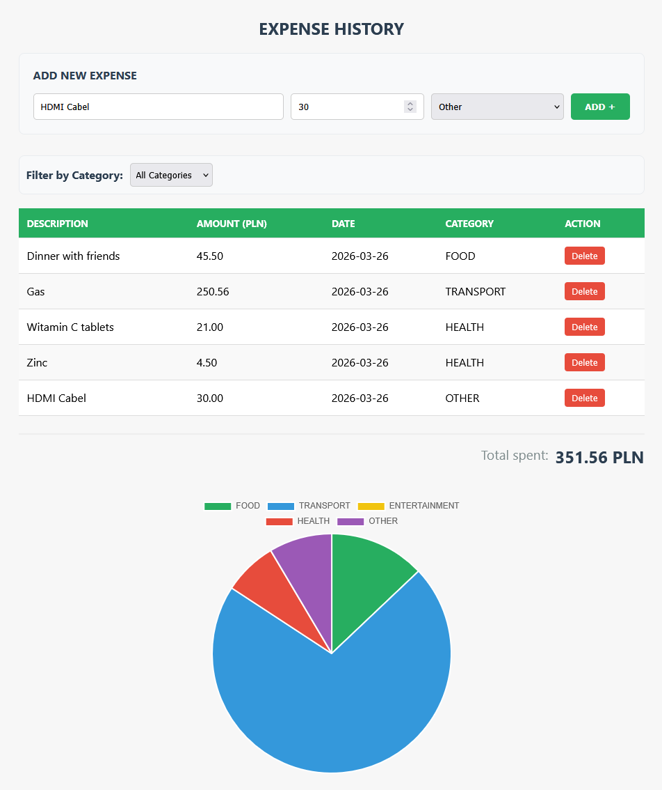

# 💹 Smart Wallet Pro | Full-Stack Finance Manager

A modern Full-Stack application for personal finance management. Built with a focus on clean code, RESTful architecture, and interactive data visualization.

## 🚀 Key Features

* **Interactive Dashboard**: Integrated **Chart.js** for real-time visual spending analysis.
* **Dynamic Filtering**: Instantly filter transactions by category (Food, Entertainment, Transport) without page reloads.
* **RESTful API**: Clean communication between Spring Boot backend and JavaScript frontend using Fetch API.
* **Data Persistence**: Automatic data storage in a local file system, simulating database behavior.

## 🛠️ Tech Stack

| Layer | Technology |
| :--- | :--- |
| **Backend** | Java 17, Spring Boot 3, Maven |
| **Frontend** | Modern JavaScript (ES6+), HTML5, CSS3 |
| **Data Viz** | Chart.js |

## 📈 Preview

  

---
*Project developed to master Object-Oriented Programming and Web Development patterns.*
