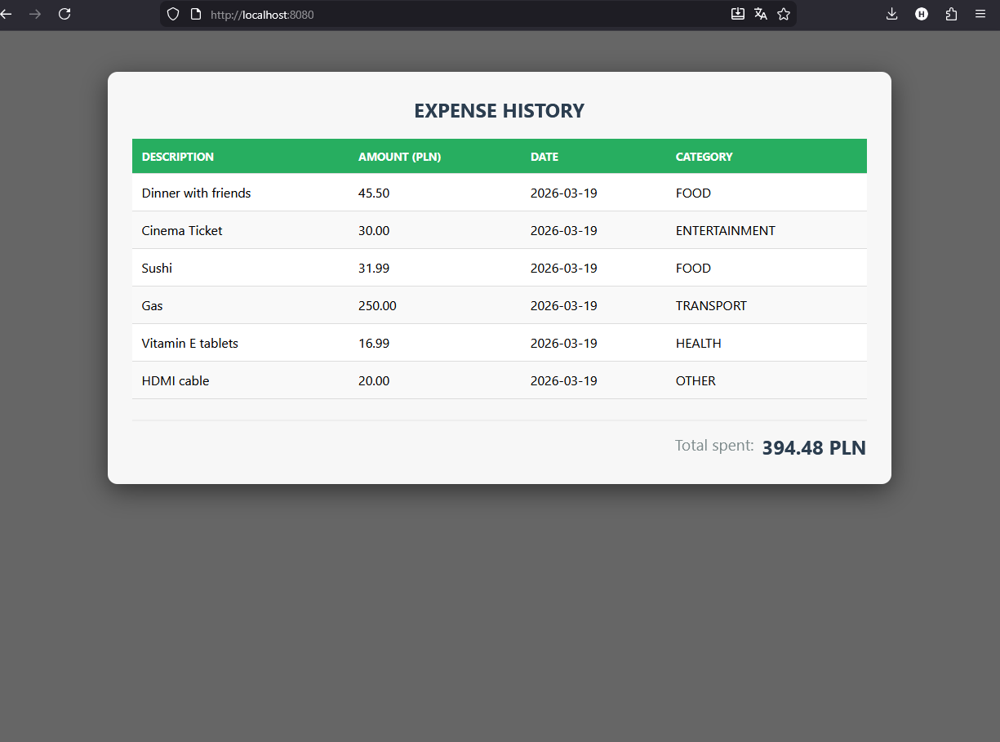
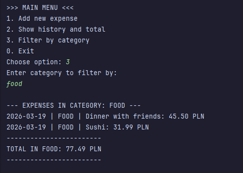

# 💰 Expense Tracker Pro

A modern, full-stack web application for personal finance management. Built with a focus on clean code and user experience.

## 🚀 Features
- **Interactive Web Interface:** Clean and responsive UI for viewing expenses.
- **Real-time API:** Backend powered by Spring Boot providing a RESTful JSON API.
- **Smart Filtering:** Ability to filter expenses by category (Food, Entertainment, etc.).
- **Automatic Calculations:** Real-time total and filtered sum calculations using high-precision `BigDecimal`.

## 🛠 Tech Stack
- **Backend:** Java 21, Spring Boot 3
- **Frontend:** HTML5, CSS3, JavaScript (Fetch API)
- **Build Tool:** Maven

## 📸 Preview

### Web Dashboard

### Terminal Logic & Filtering

## ⚙️ How to run
1. Clone the repository.
2. Run `Main.java` in your favorite IDE.
3. Open `http://localhost:8080` in your browser.
